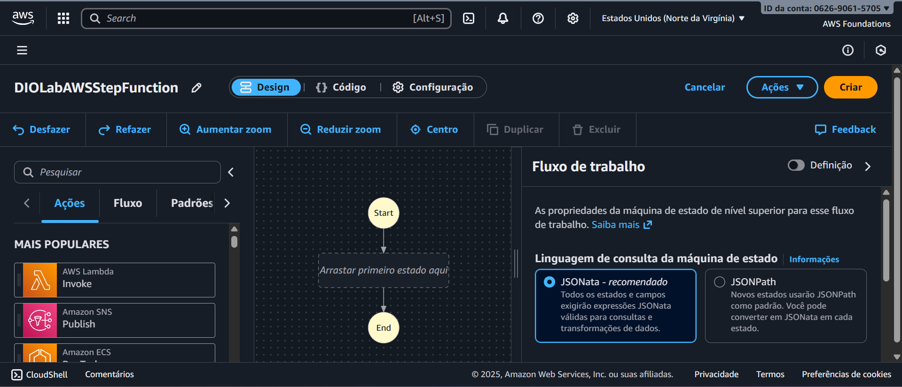
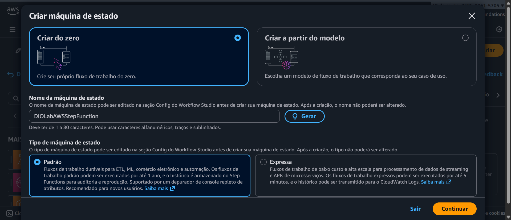
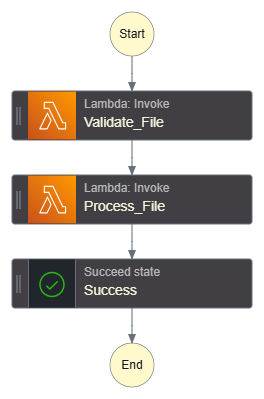

# 🚀 Desafio DIO – AWS Step Function

Este projeto foi desenvolvido como parte da formação **AWS Cloud Foundations** da DIO, com o objetivo de consolidar o conhecimento sobre **AWS Step Functions** e sua integração com outros serviços da AWS, como o **Lambda**, **S3** e **EC2**.

O **AWS Step Functions** é um serviço que permite criar fluxos de trabalho (workflows) automatizados e coordenar a execução de múltiplos serviços em uma arquitetura *serverless*.  
Por meio dele, é possível definir cada etapa do fluxo e controlar a ordem em que as funções e serviços serão executados, garantindo maior organização e escalabilidade.

---

## 🧩 Objetivo do Laboratório

- Aplicar os conceitos aprendidos sobre **Step Functions** em um ambiente prático.  
- Entender como orquestrar **funções Lambda** em um fluxo automatizado.  
- Documentar o processo de criação e configuração do workflow.  
- Utilizar o **GitHub** para registrar e compartilhar a documentação técnica.

---

## 🛠️ Passo a Passo Realizado

### 1️⃣ Criação da Máquina de Estado

No console da AWS, acessei o serviço **Step Functions** e selecionei a opção **“Criar do zero”**.  
O fluxo foi configurado como **Padrão**, para armazenar o histórico e permitir depuração visual.

- **Nome da máquina:** `DIOLabAWSStepFunction`  
- **Tipo:** Padrão  
- **Execução:** Manual  

---

## 📸 Evidências do Projeto

**Etapa de criação:**



**Editor de design do Step Functions antes da criação:**



**Fluxo completo criado com as etapas Lambda e estado final:**



**Confirmação de criação com sucesso:**


---

## 🧠 Definição da Máquina de Estado (State Machine)

Abaixo está o código JSON criado no **Step Functions**, utilizando o padrão **Amazon States Language (ASL)**.  
Ele define a sequência de execução das funções e o encerramento do fluxo.

```json
{
  "Comment": "Fluxo simples Step Functions: validar -> processar -> sucesso",
  "StartAt": "Validate_File",
  "States": {
    "Validate_File": {
      "Type": "Task",
      "Resource": "arn:aws:states:::lambda:invoke",
      "Parameters": {
        "FunctionName": "arn:aws:lambda:us-east-1:062690615705:function:ValidateFileFunction",
        "Payload.$": "$"
      },
      "OutputPath": "$.Payload",
      "Retry": [
        {
          "ErrorEquals": [
            "Lambda.ServiceException",
            "Lambda.AWSLambdaException",
            "Lambda.SdkClientException",
            "Lambda.TooManyRequestsException"
          ],
          "IntervalSeconds": 1,
          "MaxAttempts": 3,
          "BackoffRate": 2,
          "JitterStrategy": "FULL"
        }
      ],
      "Next": "Process_File"
    },
    "Process_File": {
      "Type": "Task",
      "Resource": "arn:aws:states:::lambda:invoke",
      "Parameters": {
        "FunctionName": "arn:aws:lambda:us-east-1:062690615705:function:ProcessFileFunction",
        "Payload.$": "$"
      },
      "OutputPath": "$.Payload",
      "Retry": [
        {
          "ErrorEquals": [
            "Lambda.ServiceException",
            "Lambda.AWSLambdaException",
            "Lambda.SdkClientException",
            "Lambda.TooManyRequestsException"
          ],
          "IntervalSeconds": 1,
          "MaxAttempts": 3,
          "BackoffRate": 2,
          "JitterStrategy": "FULL"
        }
      ],
      "Next": "Success"
    },
    "Success": {
      "Type": "Succeed"
    }
  }
}

```

## 💡 Explicação do Código

- **Comment:** descrição geral do fluxo de trabalho.  
- **StartAt:** indica qual estado é executado primeiro.  
- **Type: "Task":** define uma tarefa que chama uma função Lambda.  
- **Resource:** identifica o tipo de integração (no caso, `lambda:invoke`).  
- **Parameters:** parâmetros enviados à Lambda.  
- **Retry:** garante resiliência em caso de falhas temporárias.  
- **Success:** finaliza a execução com status de sucesso.  

Cada função Lambda (`ValidateFileFunction` e `ProcessFileFunction`) representa uma etapa isolada do processo.  
Mesmo sem execução real, o fluxo demonstra o conceito de **coordenação entre funções e controle de etapas**.

---

## 🧮 Benefícios do AWS Step Functions

- **Orquestração visual e controlada:** cada passo do processo é representado graficamente.  
- **Escalabilidade automática:** integra com Lambda e outros serviços sem precisar gerenciar servidores.  
- **Monitoramento detalhado:** logs, histórico e visualização de estados.  
- **Alta disponibilidade:** serviço totalmente gerenciado pela AWS.  

---

## 📘 Conclusão

O desafio consolidou o aprendizado sobre a criação de fluxos *serverless* com **AWS Step Functions**, permitindo compreender o funcionamento de automações e a integração entre serviços da AWS.

Com esta prática, foi possível:

- Criar uma máquina de estado do zero no **Workflow Studio**.  
- Definir etapas com **funções Lambda simuladas**.  
- Documentar o processo técnico no **GitHub**, conforme os padrões de boas práticas.  

---

## 👩‍💻 Autora

**Lorena Cardoso Sanches**  
Formação **AWS Cloud Foundations – DIO & Santander Code Girls**  
📍 São Bernardo do Campo – SP  
🔗 [linkedin.com/in/lorenacardososanches](https://linkedin.com/in/lorenacardososanches)
